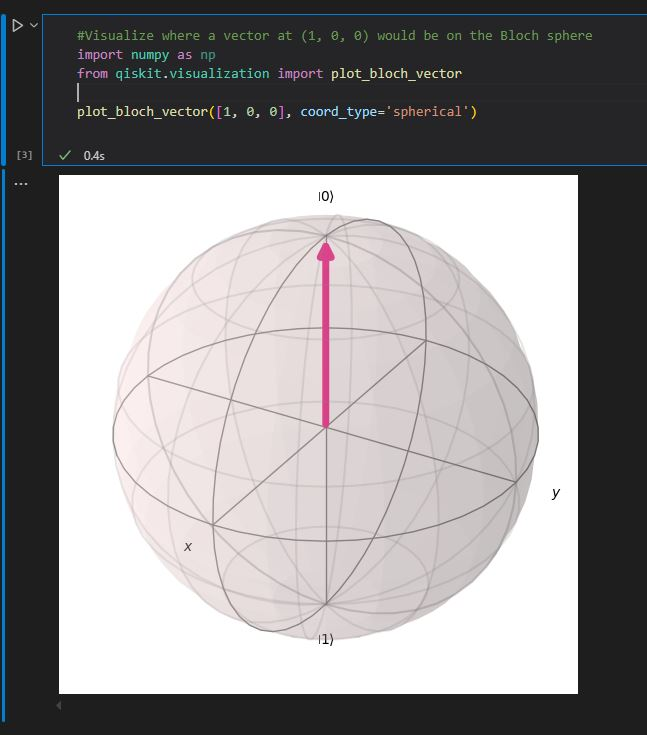

• Bloch Sphere Visualization Tasks
    1 Visualize and Draw Vectors in Cartesian Coordinates:
        ▪ Visualize where a vector at (1, 0, 0) would be on the Bloch sphere.
        ▪ Then, use a script to draw this vector.
        ▪ Visualize and draw a vector that is "behind me" (implied negative x-axis).
        ▪ Visualize and plot a vector that is "down and slightly towards my right" (implied negative Z and negative Y axis) using the script by tweaking its values.
         

    2 Experiment with Spherical Coordinates for Bloch Sphere:
        ▪ You need to represent vectors using the spherical coordinate system, which requires length, polar angle, and azimuthal angle as arguments.
        ▪ Draw vectors that align on the positive X-axis, positive Y-axis, negative Y-axis, negative X-axis, and negative Z-axis.
        ▪ For a vector aligning on the positive X-axis, the polar angle will be 90 degrees (π/2) and the azimuthal angle will be 0.
        ▪ For a vector aligning on the negative Y-axis, the polar angle will be 90 degrees (π/2) and the azimuthal angle will be 
        270 degrees (3π/2).
        ▪ For a vector aligning on the negative X-axis, the polar angle will be 90 degrees (π/2) and the azimuthal angle will be 180 degrees (π).
        ▪ You are instructed to download and execute the script, manipulating these angles to project the fundamental vector alignments.

• State Vector Calculation Tasks
    ◦ Calculate the State Vector for a Given Circuit (Task 1): Calculate the state vector for a circuit that begins with two qubits (0, 0) and applies a Hadamard gate (H) on the first qubit and an X gate on the second qubit.
    ◦ Home Assignment: Circuit Design and State Vector Verification (Task 2):
        ▪ For a circuit with a Hadamard gate, an X gate, and another X gate, where the initial states are 0, 1, and 1 respectively, calculate its state vector.
        ▪ Then, using the provided script, design this circuit by tweaking the existing script and verify if the state vector you computed matches what the system gives you.

                To calculate the state vector for a circuit that begins with two qubits in the (0, 0) state and applies a Hadamard (H) gate to the first qubit and an X gate to the second qubit

                Steps:
                1. Represent the Initial State Vector:
                    ◦ A qubit is a superposition of the fundamental states |0⟩ and |1⟩. In quantum computing, these states are typically represented as column vectors. The sources indicate that a system initialized with two qubits at (0, 0) begins in the |00⟩ state.
                    ◦ The standard representation for the single-qubit states is:
                        ▪ |0⟩ = ᵀ
                        ▪ |1⟩ = ᵀ
                    ◦ For a multi-qubit system, the combined state is represented by the tensor product of the individual qubit states.
                    ◦ Therefore, the initial state |00⟩ is: |00⟩ = |0⟩ ⊗ |0⟩ = ᵀ ⊗ ᵀ = ᵀ = ᵀ.
                2. Identify the Unitary Matrices for the Gates:
                    ◦ Quantum gates are modeled through unitary matrices. The task requires you to "figure out their unitary matrices".
                    ◦ Hadamard (H) Gate: This gate puts a qubit into a superposition. If |0⟩ is input, it produces a superposition of both |0⟩ and |1⟩. H = 1/√2 * [, [1, -1]]
                    ◦ Pauli-X (X) Gate: This gate acts as a NOT gate; if |0⟩ is input, it gives |1⟩. X = [,]
                3. Construct the Combined Gate Operator:
                    ◦ To apply the Hadamard gate to the first qubit and the X gate to the second qubit simultaneously in a two-qubit system, you use the tensor product of their respective unitary matrices.
                    ◦ The combined gate is H ⊗ X: H ⊗ X = 1/√2 * [, [1, -1]] ⊗ [,]
                    ◦ To calculate the tensor product of two matrices, each element of the first matrix is scalar-multiplied by the entire second matrix: H ⊗ X = 1/√2 * [ [1*X, 1*X], [1*X, -1*X] ] Expanding this into a 4x4 matrix: H ⊗ X = 1/√2 * [ [,], [,], [,], [[0,-1],[-1,0]] ] Which results in: H ⊗ X = 1/√2 * [,, [0, 1, 0, -1], [1, 0, -1, 0]]
                4. Calculate the Final State Vector by Matrix Multiplication:
                    ◦ The final state vector is obtained by multiplying the combined gate operator matrix by the initial state vector.
                    ◦ Final State Vector = (H ⊗ X) |00⟩.
                    ◦ 1/√2 * [,, [0, 1, 0, -1], [1, 0, -1, 0]] * ᵀ
                    ◦ Performing the matrix multiplication:
                        ▪ Row 1: (0*1 + 1*0 + 0*0 + 1*0) = 0
                        ▪ Row 2: (1*1 + 0*0 + 1*0 + 0*0) = 1
                        ▪ Row 3: (0*1 + 1*0 + 0*0 + -1*0) = 0
                        ▪ Row 4: (1*1 + 0*0 + -1*0 + 0*0) = 1
                    ◦ Thus, the resulting state vector is: Final State Vector = 1/√2 *ᵀ
                5. Interpret the State Vector:
                    ◦ The entries of the state vector correspond to the amplitudes of the possible basis states in a two-qubit system: |00⟩, |01⟩, |10⟩, and |11⟩, respectively.
                    ◦ From the calculated state vector [0, 1/√2, 0, 1/√2]ᵀ, we can see the amplitudes:
                        ▪ Amplitude for |00⟩ is 0
                        ▪ Amplitude for |01⟩ is 1/√2
                        ▪ Amplitude for |10⟩ is 0
                        ▪ Amplitude for |11⟩ is 1/√2
                    ◦ Therefore, the state vector can be written as (1/√2)|01⟩ + (1/√2)|11⟩.

• Unitary Matrix Task
    ◦ Identify and Test Unitary Matrices for Gates: For the quantum gates you are familiar with (Hadamard and X gates), figure out their unitary matrices.
    ◦ Multiply each matrix twice (A × A) and check if the result is an identity matrix. This demonstrates that these gates are represented by unitary matrices that are self-inverse.